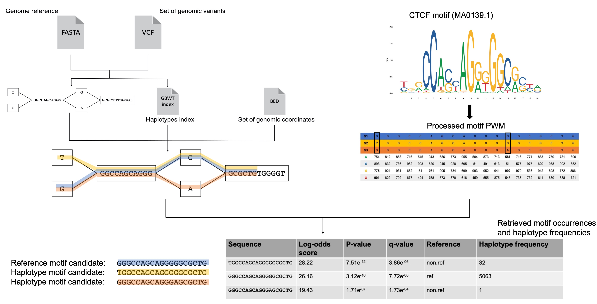

[](http://bioconda.github.io/recipes/grafimo/README.html)
[](https://travis-ci.org/pinellolab/GRAFIMO)
[](https://anaconda.org/bioconda/grafimo)
[](https://anaconda.org/bioconda/grafimo)

# GRAFIMO
GRAph-based Finding of Individual Motif Occurrences



Regulatory proteins, such as Transcription Factors (TFs), are key genomic elements which promote or reduce the expression of genes by binding short, evolutionary conserved DNA sequences, often referred to as motifs. Mutations occurring in DNA motifs have been shown to have deleterious effects on the transcriptional landscape of the cell (Li & Ovcharenko, 2015; Guo et al., 2018). The recent introduction of Genome Variation Graphs (VG) (Garrison et al., 2018) allowed to represent in a single and efficient data-structure the genomic variation present within a population of individuals.

GRAFIMO (GRAph-based Finding of Individual Motif Occurrences) is a command-line tool that extends the traditional Position Weight Matrix (PWM) scanning procedure to VGs. GRAFIMO can search the occurrences of a given PWM in many genomes in a single run, accounting for the effects that SNPs, indels and potentially any structural variation (handled by VG) have on found potential motif occurrences. As result, GRAFIMO produces a report containing the statistically significant motif candidates found, reporting their frequency within the haplotypes embedded in the scanned VG and if they contain genomic variants or belong to the reference genome sequence.

## Installation


### Install dependencies
GRAFIMO depends on a number of external tools and Python packages. Before installing GRAFIMO you should install
- VG, v1.27.1 or later ([https://github.com/vgteam/vg](https://github.com/vgteam/vg))
- Tabix ([https://github.com/samtools/htslib](https://github.com/samtools/htslib))
- Graphviz ([https://www.graphviz.org/](https://www.graphviz.org/))

**Be sure that all are reachable in Unix PATH**.

Note that is suggested to use samtools Tabix and not the one coming with VG. If the user is not sure about which tabix is running, he/she can type ```which tabix```, to retrieve which is the currently used Tabix.

GRAFIMO is written in both Python3 and Cython. Thus, the user will need Cython to be installed to correctly build GRAFIMO. Cython can be obtained via pip
```
pip3 install Cython
```

To build GRAFIMO are used ```setuptools``` and ```wheel```. The user should make sure he/she has the latest version of both ```setuptools``` and ```wheel```
```
python3 -m pip install --user --upgrade setuptools wheel
```

GRAFIMO depends on a number of Python packages. If the dependencies are not satisfied, by building GRAFIMO from source or via pip they should be automatically solved.

To install all the required packages:
```
pip3 install pandas
pip3 install numpy
pip3 install statsmodels
pip3 install sphinx
pip3 install numba
```

### Build

GRAFIMO can be built and installed via pip, from source code or via Bioconda. Note that the latter option is available only for Linux users.

For further details on how to install GRAFIMO visit our [Wiki](https://github.com/pinellolab/GRAFIMO/wiki).

**Build and install via pip**

To build and install GRAFIMO via pip
```
pip3 install grafimo
```

To test if GRAFIMO have been correctly installed
```
grafimo -h
```

If the help is correctly printed, then GRAFIMO have been installed and can be called from any location.

**Build and install from source code**

To build and install GRAFIMO from source code
```
git clone https://github.com/pinellolab/GRAFIMO.git 
cd GRAFIMO
python3 setup.py install --user
```

To quickly test GRAFIMO installation 
```
grafimo -h
```

If the help is correctly printed, then GRAFIMO have been installed and can be called from any location.

It is also possible to test all the main functionalities of GRAFIMO using ```pytest``` ([https://docs.pytest.org/en/stable/](https://docs.pytest.org/en/stable/)).

To install ```pytest```
```
pip3 install pytest
```

Once ```pytest``` have been installed, enter the ```tests``` directory and launch ```pytest```
```
cd tests
pytest
```

If no test fails, then all GRAFIMO functionalities work properly.

**Build and install via Bioconda (Linux users only)**

To install GRAFIMO via Bioconda the user should first have the ```conda``` package installed. If the user have an Anaconda Python installation, ```conda``` is already available, otherwise it can be installed with [Miniconda](https://conda.io/en/latest/miniconda.html) package. For further details ([https://bioconda.github.io/user/install.html](https://bioconda.github.io/user/install.html)).

Once ```conda``` is available, to install GRAFIMO
```
conda install grafimo
```

To update GRAFIMO
```
conda update grafimo
```

### Use GRAFIMO via Docker (All Operating Systems including MacOS and Windows)

For MacOS and Windows users is suggested to run GRAFIMO via [Docker](https://www.docker.com/get-started). 

The user can both pull an already built GRAFIMO docker image or build it from scratch. The user has also to ensure that Docker is currently installed and there are no too strict limits on the number of CPUs and amount of memory that Docker can use ([https://docs.docker.com/config/containers/resource_constraints/](https://docs.docker.com/config/containers/resource_constraints/) for further details).  

To pull the pre-built Docker image:
```
docker pull pinellolab/grafimo
```
To test if the image is correctly running, type:
```
docker run -i pinellolab/grafimo grafimo -h
```
If the help is correctly displayed, then the image has been correctly pulled.

To build GRAFIMO Docker image from scratch, the user should clone or download GRAFIMO's github repository:
```
git clone https://github.com/pinellolab/GRAFIMO.git
cd GRAFIMO
```
and build the image:
```
docker build -t grafimo .
```
To test if the image has been correctly built, type:
```
docker run -i grafimo grafimo -h
```
If the help is correctly displayed, then the image has been correctly built.

## Usage

For hands-on tutorials on how to use GRAFIMO check out our [tutorials](https://github.com/pinellolab/GRAFIMO/tree/master/tutorials). 

For further details on GRAFIMO usage refer to our [Wiki](https://github.com/pinellolab/GRAFIMO/wiki).

### Searching potential motif occurrences with GRAFIMO

#### Input

GRAFIMO requires three mandatory arguments:

- path to a directory containing the chromosomes VGs (XG and GBWT indexes) or path to the whole genome variation graph (XG and GBWT indexes). See [VG's wiki](https://github.com/vgteam/vg/wiki) for further details on XG and GBWT indexes.

- path to PWM motif file in MEME or JASPAR format

- BED file containing a set of genomic regions where GRAFIMO will search the motif occurrences

#### Searching motif

The main functionality of GRAFIMO is to perform a haplotype and variant-aware search of potential DNA motif occurrences in genome variation graph. 

Here we assume that the genome variation graph (VG) has been built constructing a VG for each chromosome. If working with a single whole genome variation graph just substitute the argument ```-d``` with ```-g``` followed by the path to the whole genome VG. In the next section will be presented how to build a VG with GRAFIMO.

Note that in both cases **the XG and GBWT indexes of the VG  must be stored in the same location**.

For further details refer to our [Wiki](https://github.com/pinellolab/GRAFIMO/wiki).

If you are working in the ```tutorials/findmotif_tutorial``` directory, to run GRAFIMO
```
grafimo findmotif -d data/mygenome/ -m  data/example.meme -b data/regions.bed
```

By default GRAFIMO will create a directory called `grafimo_out_PID_MOTIFID`, containing the results. For further details on result files see **Results description** section.


#### Advanced options

***Using background distributions***

For each potential motif occurrence GRAFIMO computes a log-likelihood score, a *P*-value and a *q*-value. Such measures are weighted by a background probability distribution. By default, GRAFIMO assumes a uniform background distribution for nucleotides. The user can specify a different background distribution in a text file and give it to GRAFIMO using `-k` option. An example of background file is
```
A	0.2951
C	0.2047
T	0.2955
G	0.2048
```

For an example of background files accepted by GRAFIMO, take a look at [`bg_nt`](https://github.com/pinellolab/GRAFIMO/blob/master/tutorials/findmotif_tutorial/data/bg_nt) in `tutorials/findmotif_tutorial/data` directory.

If you are working in ```tutorials/findmotif_tutorial``` directory, to run GRAFIMO with a background distribution
```
grafimo findmotif -d data/mygenome/ -m data/example.meme -b data/regions.bed -k data/bg_nt 
```

***Setting thresholds on motif occurrences statistical significance***

By default GRAFIMO applies a threshold of 1e-4 on the *P*-value of each retrieved potential motif occurrence. So, will be reported the motif candidates with an associated *P*-value smaller than 1e-4. The threshold can be changed by using the `-t` option. For example, let us set a threshold of 0.05 on the *P*-values.

If you are working in ```tutorials/findmotif_tutorial``` directory, to run GRAFIMO applying a different threshold on *P*-values 
```
grafimo findmotif -d data/mygenome -m data/example.meme -b data/regions.bed -t 0.05
```

GRAFIMO, besides *P*-values, computes *q*-values for the motif occurrences candidates. The user can apply a threshold on *q*-values, rather than on *P*-values, by using the `--qvalueT` option. `--qvalueT` option can be used in combination with `-t` to define a threshold value different from 1e-4. Let us apply a threshold of 1e-4 on *q*-values.

If you are working in ```tutorials/findmotif_tutorial``` directory, to run GRAFIMO applying a threshold on *q*-values
```
grafimo findmotif -d data/mygenome -m data/example.meme -b data/regions.bed --qvalueT -t 1e-4
```

#### For more options

For more options refer to our [Wiki](https://github.com/pinellolab/GRAFIMO/wiki) or type
```
grafimo -h
```

#### Results description

GRAFIMO results are reported in three files (stored in output directory):
- tab-delimited report (TSV report)
- HTML report
- GFF3 report

The TSV report contains all the statistically significant potential motif occurrence found by GRAFIMO (according to the applied threshold). Each retrieved motif occurrence has a log-likelihood score, a *P*-value, a *q*-value, its DNA sequence, a flag value stating if a sequence is part of the reference or has been found in the haplotypes and the number of haplotype sequences where the motif candidate sequence occurs. An example of TSV report is the following
```
	motif_id	motif_alt_id	sequence_name	start	stop	strand	score	p-value	q-value	matched_sequence	haplotype_frequency	reference
1	MA0139.1	CTCF	chr22:43481590-43481860	43481733	43481714	-	21.26229508196724	4.403657357543095e-08	0.004175283686980911	AAGCCAGCAGGGGGCACAG	5096	ref
2	MA0139.1	CTCF	chr22:19038291-19038561	19038422	19038441	+	19.245901639344254	1.9442011615088443e-07	0.005962538354344465	TGGCCAGCAAGGGGCACTG	4	non.ref
3	MA0139.1	CTCF	chr22:19038291-19038561	19038422	19038441	+	19.114754098360663	2.1268826066771178e-07	0.005962538354344465	CGGCCAGCAAGGGGCACTG	5092	ref
4	MA0139.1	CTCF	chr22:40856678-40856948	40856891	40856910	+	18.295081967213093	3.6764803446618004e-07	0.005962538354344465	TCCCCTCCAGGGGGCGACG	5096	ref
5	MA0139.1	CTCF	chr22:11285607-11285877	11285804	11285785	-	18.213114754098342	3.8774723287177635e-07	0.005962538354344465	ATACCGCCAGGTGGCAGCA	5096	ref
6	MA0139.1	CTCF	chr22:22125904-22126174	22126044	22126063	+	18.13114754098359	4.088625891963074e-07	0.005962538354344465	CAGCCTGCAGATGGCACAG	5096	ref
7	MA0139.1	CTCF	chr22:20146797-20147067	20147010	20147029	+	17.688524590163922	5.4295945317287e-07	0.005962538354344465	CGGCCCGCAGGGGGCGGAT	5092	ref
8	MA0139.1	CTCF	chr22:34842682-34842952	34842827	34842846	+	17.672131147540995	5.486120126825257e-07	0.005962538354344465	GAGCCAGTAGGGGACAGCG	146	non.ref
9	MA0139.1	CTCF	chr22:42532903-42533173	42533062	42533081	+	17.622950819672155	5.659801842459994e-07	0.005962538354344465	GGGCCACCAGAGGGCTCCT	5096	ref
10	MA0139.1	CTCF	chr22:34842682-34842952	34842827	34842846	+	17.44262295081967	6.331282484526275e-07	0.006002942174878742	GAGCCAGTAGGGGACAGTG	4950    ref
```
This report can be easily processed for a downstream analysis.

The HTML report has the same content of the TSV, but it can be loaded and viewed on the most commonly used web browsers.

The GFF3 report can be loaded on the UCSC Genome Browser as a custom track. For example, this allows a fast linking between the genomic variants used to build the VG and those present in annotated databases like dbSNP or ClinVar.  

### Building genome variation graphs (VGs) with GRAFIMO

GRAFIMO allows also to build a genome variation graph from user data. To construct the VG are required 
- a genome reference (in FASTA format)
- VCF file containing the genomic variants to enrich the reference sequence.

GRAFIMO builds the genome variation graph by constructing a VG for each chromosome. This allows a faster and more efficient motif search on the genome variation graph. 

Note that this genome variation graph building approach is suggested by VG developers.

GRAFIMO will construct the XG and the GBWT index for each chromosome. The XG and GBWT indexes allow a faster and haplotype-aware motif search on VG. 

Before attempting to build the VG it is very important to make sure that the chromosome names in the VCF and in the reference FASTA sequence headers match. For example, if in the VCF the chromosome 1 is named `1`, the header of chromosome 1 sequence on the reference FASTA file should be `>1`, and not something like `>chr1`.

If you are in ```tutorials/buildvg_tutorial``` directory, to build a VG with GRAFIMO
```
grafimo buildvg -l data/xy.fa -v data/xy2.vcf.gz    
```

For further details refer to our [Wiki](https://github.com/pinellolab/GRAFIMO/wiki).

## References 

Li, Shan, and Ivan Ovcharenko. "Human enhancers are fragile and prone to deactivating mutations." *Molecular biology and evolution* 32.8 (2015): 2161-2180.

Guo, Yu Amanda, et al. "Mutation hotspots at CTCF binding sites coupled to chromosomal instability in gastrointestinal cancers." *Nature communications* 9.1 (2018): 1-14.

Garrison, Erik, et al. "Variation graph toolkit improves read mapping by representing genetic variation in the reference." *Nature biotechnology* 36.9 (2018): 875-879.

## Citation

If you use GRAFIMO in your research, please cite us:

Tognon, Manuel, et al. "GRAFIMO: variant and haplotype aware motif scanning on pangenome graphs." bioRxiv (2021).

## License

MIT

